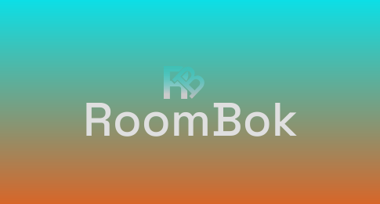

## Introduction 

This project allows to do some reservations of room inside the school.

The purpose is to have a correct UI/UX to see what room are currently book and to make quickly and easily a reservation.

### Stack Technique

The stack are describe in two different parts 
- Frontend
- Backend

#### Frontend

| Language    | why ?                                                                                      |
| ---------- | ----------------------------------------------------------------------------------------------- |
| Typescript | Use for the conception of the frontend                            |
| React      | framework able to create component and oranize for each page view |
| Vite       | development server fast for the compilation and optimize                                         |

#### Backend

| Language    | why ?                                                                   |
| ---------- | ---------------------------------------------------------------------------- |
| Typescript | allows to create all the backend logic                             |
| ORM        | library use to make SQL request, without to write manually SQL |

#### Third software

| Language    | why ?                                                                   |
| ---------- | ---------------------------------------------------------------------------- |
| Postmann | To test different http verb for the backend                              |

#### Base De Donnée 

Use of "Supabase" with PostgreSQL

#### Sketchup

Sketchup is to create the 2D school diagram

#### Figma

Figma for the modeling UI/UX and to create and iterate for each component

And to export to SVG extension file the plan of the school

### Log Format

Is the log format expected **CLF Common Log Format**. 

Some tools are available to fetch the date **Grafana & ELK** who allows to do some graphical chart from the data.

## RoadMAP

- [ ] Conception (MCD / UML)
- [ ] Backend (Architecture / ORM Relation BDD / API REST)
- [ ] Frontend (Communication / Navigation / Interfacage)
- [ ] Reservation + Security (Authentification / Users Access etc...)