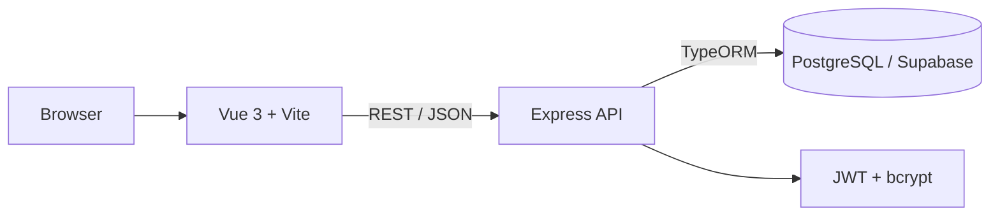
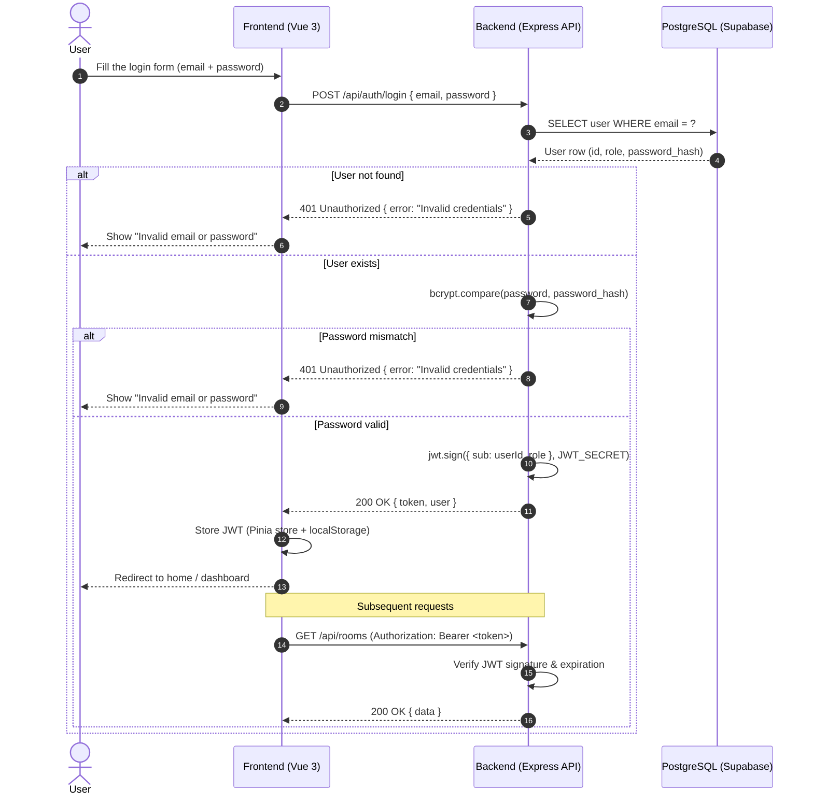
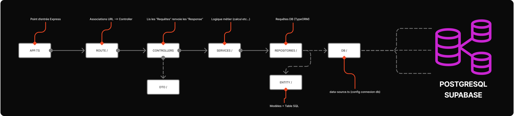
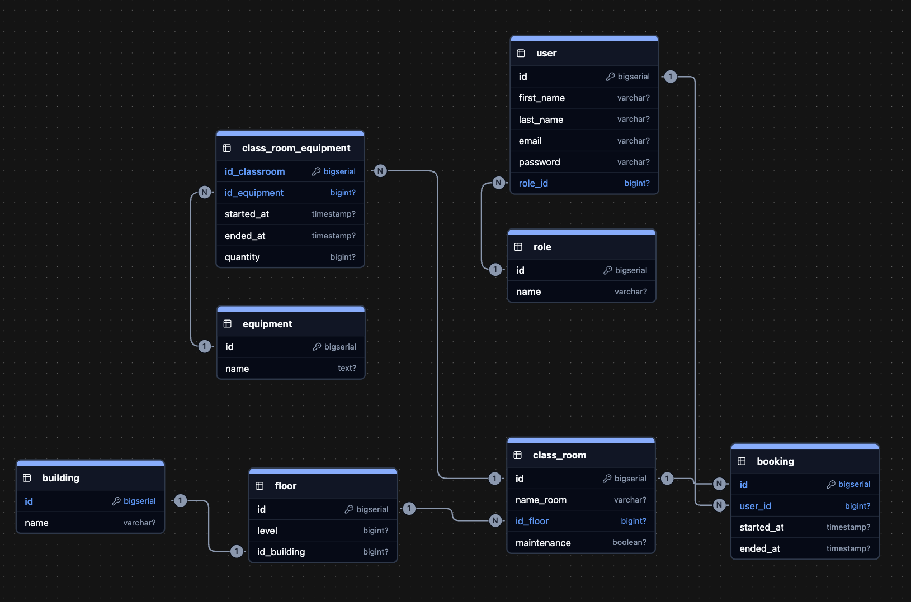

# Rooms Management


## Introduction

Rooms Management is a school room reservation application. It allows students and teachers to view classroom availability and book rooms quickly through a clean UI/UX.

## Features

- Browse buildings, floors, classrooms and equipments
- Create and manage room reservations (bookings)
- Role-based access (Administrator, Teacher, Student)
- REST API consumed by a Vue 3 frontend
- PostgreSQL persistence via Supabase

## Project Structure

```text
room-bok/
├── assets/                 # Logos, diagrams, floor plans
├── backend/
│   ├── .env.example        # Template for backend environment variables
│   ├── package.json
│   └── src/
│       ├── app.ts          # Express entrypoint
│       ├── controllers/    # Request handlers
│       ├── db/             # TypeORM data source
│       ├── dto/            # Zod schemas (input validation)
│       ├── entity/         # TypeORM entities
│       ├── middleware/     # Express middlewares (auth, etc.)
│       ├── migration/      # SQL migrations (gitignored)
│       ├── repositories/   # Data access layer
│       ├── routes/         # Express routers
│       ├── seeders/        # DB seeders for testing
│       └── services/       # Business logic
├── frontend/
│   ├── .env.example        # Template for frontend environment variables
│   ├── package.json
│   ├── vite.config.ts
│   └── src/                # Vue 3 + Vite app
│       ├── api/            # Axios clients
│       ├── components/
│       ├── router/         # vue-router definitions
│       ├── stores/         # Pinia stores
│       └── views/
├── doc/
│   ├── backend_doc/        # Roadmap, API routes
│   └── wiki.md
└── README.md
```

## Architecture



### Authentication Flow

> Planned flow for the upcoming login feature — describes how the frontend, backend and database cooperate to authenticate a user and issue a JWT.



## Stack

### Frontend

| Tech              | Why ?                                          |
| ----------------- | ---------------------------------------------- |
| TypeScript        | Type-safe frontend code                        |
| Vue 3             | Reactive component framework                   |
| Vite              | Fast dev server and build tool                 |
| vue-router        | Client-side routing                            |
| Pinia             | State management                               |
| Axios             | HTTP client to call the backend API            |
| Naive UI          | Vue 3 component library                        |
| Tailwind CSS      | Utility-first styling                          |
| Phosphor Icons    | Icon set                                       |
| date-fns          | Date manipulation utilities                    |
| Playwright        | End-to-end testing                             |

### Backend

| Tech       | Why ?                                                    |
| ---------- | -------------------------------------------------------- |
| TypeScript | Type-safe backend code                                   |
| Express 5  | Minimal HTTP server framework                            |
| TypeORM    | ORM for PostgreSQL, avoids writing raw SQL               |
| Zod        | Runtime validation of incoming payloads                  |
| bcrypt     | Password hashing                                         |
| JWT        | Stateless authentication tokens                          |
| dotenv     | Loads environment variables from `.env`                  |
| nodemon    | Auto-restart of the dev server on file change            |

### Database

This project uses **PostgreSQL** as its relational database, hosted on **[Supabase](https://supabase.com/)**.

| Tech       | Why ?                                                                |
| ---------- | -------------------------------------------------------------------- |
| PostgreSQL | Relational database — strong typing, transactions, foreign keys      |
| Supabase   | Managed Postgres hosting — connection string, dashboard, free tier   |

The backend connects to Supabase through the standard `pg` driver via TypeORM. Connection details are read from the `DB_*` variables in `backend/.env` (see [Getting Started → Backend setup](#2-backend-setup)) — you can grab them from your Supabase project under **Project Settings → Database → Connection info**.

### Tooling

| Tool     | Why ?                                       |
| -------- | ------------------------------------------- |
| Postman  | Manual testing of HTTP endpoints            |
| Sketchup | 2D school diagrams                          |
| Figma    | UI/UX design and SVG export of school plans |

## Backend Structure



## Database Schema (UML)

UML diagram of the PostgreSQL schema — entities, relationships and cardinalities behind the API.



## Log Format

The expected log format is **CLF (Common Log Format)**.

Logs can be ingested by **Grafana & ELK** to produce charts and dashboards.

## Getting Started

### Prerequisites

- **Node.js 20+**
- **npm** (bundled with Node.js)
- A reachable **PostgreSQL** database (a Supabase project works out of the box)

Check your versions:

```bash
node --version
npm --version
```

### 1. Clone the repository

```bash
git clone https://github.com/MayBeLinux/room-bok.git
cd room-bok
```

### 2. Backend setup

Install the dependencies:

```bash
cd backend
npm install
```

Copy the environment template and fill it in:

```bash
cp .env.example .env
```

`backend/.env` expects the following variables:

```dotenv
# ---------- Server ----------
NODE_ENV=development
PORT=3000
BASE_URL=http://localhost:3000
CORS_ORIGIN=http://localhost:5173
API_PREFIX=/api

# ---------- Auth ----------
JWT_SECRET=replace-with-a-long-random-string
JWT_EXPIRES_IN=1d

# ---------- Database ----------
DB_HOST=your-db-host
DB_PORT=5432
DB_USERNAME=your-db-user
DB_PASSWORD=your-db-password
DB_DATABASE=your-db-name
```

Apply the migrations and seed the database:

```bash
npm run migration:run
npm run seed
```

Start the development server (auto-reloads on file change, listens on `http://localhost:3000`):

```bash
npm run dev
```

The API is exposed under the `/api` prefix (e.g. `http://localhost:3000/api/rooms`).

#### Available backend npm scripts

| Script                        | What it does                                                       |
| ----------------------------- | ------------------------------------------------------------------ |
| `npm run dev`                 | Start the Express server with `nodemon` + `ts-node`                |
| `npm run build`               | Compile TypeScript to `dist/`                                      |
| `npm start`                   | Run the compiled server from `dist/app.js` (production)            |
| `npm run migration:generate`  | Generate a new migration from entity changes                       |
| `npm run migration:create`    | Create an empty migration file                                     |
| `npm run migration:run`       | Apply pending migrations to the database                           |
| `npm run migration:revert`    | Revert the last applied migration                                  |
| `npm run migration:show`      | List migrations and their status                                   |
| `npm run seed`                | Populate the database with the seed data in `src/seeders/`         |

### 3. Frontend setup

In a **second terminal**, from the repository root:

```bash
cd frontend
npm install
```

Copy the environment template:

```bash
cp .env.example .env
```

`frontend/.env` only needs the URL of the running backend API:

```dotenv
VITE_API_URL=http://localhost:3000/api
```

Start the Vite dev server (listens on `http://localhost:5173` — already allowed by the backend CORS configuration):

```bash
npm run dev
```

#### Available frontend npm scripts

| Script             | What it does                                              |
| ------------------ | --------------------------------------------------------- |
| `npm run dev`      | Start the Vite dev server with HMR on port 5173           |
| `npm run build`    | Type-check (`vue-tsc`) and bundle the app for production  |
| `npm run preview`  | Preview the production build locally                      |

### 4. Quick verification

Once both servers are running:

- Open `http://localhost:5173` to access the app
- Hit `http://localhost:3000/` — you should see the API healthcheck string
- Hit `http://localhost:3000/api/rooms` (or any other endpoint listed in [`doc/backend_doc/route-api.md`](doc/backend_doc/route-api.md)) to confirm the API is reachable

## Documentation

- API routes: [`doc/backend_doc/route-api.md`](doc/backend_doc/route-api.md)
- Backend roadmap: [`doc/backend_doc/ROADMAP.md`](doc/backend_doc/ROADMAP.md)

## Figma Design and Mockup

[Figma Design](https://www.figma.com/design/YJWSOORW6WwZXj6gXhZbui/room-bok?node-id=19-339&p=f&t=VOUlV989igtfezy6-0)

## RoadMAP

- [ ] Conception (MCD / UML)
- [ ] Documentation (Style Guide / Postman)
- [ ] Backend (Architecture / ORM Relation BDD / API REST)
- [ ] Frontend (Communication / Navigation / Interfacing)
- [ ] Reservation + Security (Authentication / User Access)
