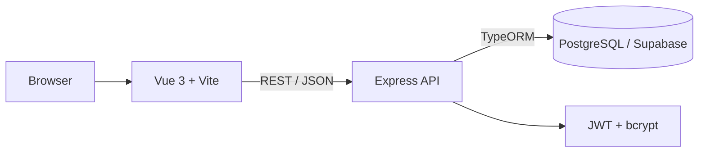

# Rooms Management


## Introduction

Rooms Management is a school room reservation application. It allows students and teachers to view classroom availability and book rooms quickly through a clean UI/UX.

## Features

- Browse buildings, floors, classrooms and equipments
- Create and manage room reservations (bookings)
- Role-based access (Administrator, Teacher, Student)
- REST API consumed by a Vue 3 frontend
- PostgreSQL persistence via Supabase

## Project Structure

```text
rooms-management/
├── assets/                 # Logos, diagrams, floor plans
├── backend/
│   └── src/
│       ├── app.ts          # Express entrypoint
│       ├── controllers/    # Request handlers
│       ├── db/             # TypeORM data source
│       ├── dto/            # Zod schemas (input validation)
│       ├── entity/         # TypeORM entities
│       ├── migration/      # SQL migrations
│       ├── repositories/   # Data access layer
│       ├── routes/         # Express routers
│       ├── seeders/        # DB seeders for testing
│       └── services/       # Business logic
├── frontend/
│   └── src/                # Vue 3 + Vite app
├── doc/
│   ├── backend_doc/        # Roadmap, API routes
│   └── frontend_doc/
└── README.md
```

## Architecture



## Stack

### Frontend

| Tech       | Why ?                                                    |
| ---------- | -------------------------------------------------------- |
| TypeScript | Type-safe frontend code                                  |
| Vue 3      | Reactive component framework                             |
| Vite       | Fast dev server and build tool                           |

### Backend

| Tech       | Why ?                                                    |
| ---------- | -------------------------------------------------------- |
| TypeScript | Type-safe backend code                                   |
| Express    | Minimal HTTP server framework                            |
| TypeORM    | ORM for PostgreSQL, avoids writing raw SQL               |
| Zod        | Runtime validation of incoming payloads                  |
| bcrypt     | Password hashing                                         |
| JWT        | Stateless authentication tokens                          |

### Database

Supabase-hosted PostgreSQL.

### Tooling

| Tool     | Why ?                                       |
| -------- | ------------------------------------------- |
| Postman  | Manual testing of HTTP endpoints            |
| Sketchup | 2D school diagrams                          |
| Figma    | UI/UX design and SVG export of school plans |

## Backend Structure


## Log Format

The expected log format is **CLF (Common Log Format)**.

Logs can be ingested by **Grafana & ELK** to produce charts and dashboards.

## Getting Started

### Prerequisites

- Node.js 20+
- npm
- A PostgreSQL database (a Supabase project works)

### 1. Clone

```bash
git clone <repo-url>
cd rooms-management
```

### 2. Backend

```bash
cd backend
npm install
```

Create a `.env` file in `backend/` with the following variables:

```dotenv
DB_HOST=your-db-host
DB_PORT=5432
DB_USERNAME=your-db-user
DB_PASSWORD=your-db-password
DB_DATABASE=your-db-name
```

Run the migrations and seed the database:

```bash
npm run migration:run
npm run seed
```

Start the dev server (listens on `http://localhost:3000`):

```bash
npm run dev
```

The API is exposed under the `/api` prefix.

### 3. Frontend

```bash
cd frontend
npm install
npm run dev
```

The Vite dev server listens on `http://localhost:5173` and is allowed by the backend CORS configuration.

## Documentation

- API routes: [`doc/backend_doc/route-api.md`](doc/backend_doc/route-api.md)
- Backend roadmap: [`doc/backend_doc/ROADMAP.md`](doc/backend_doc/ROADMAP.md)

## Figma Design and Mockup

[Figma Design](https://www.figma.com/design/YJWSOORW6WwZXj6gXhZbui/room-bok?node-id=19-339&p=f&t=VOUlV989igtfezy6-0)

## RoadMAP

- [ ] Conception (MCD / UML)
- [ ] Documentation (Style Guide / Postman)
- [ ] Backend (Architecture / ORM Relation BDD / API REST)
- [ ] Frontend (Communication / Navigation / Interfacing)
- [ ] Reservation + Security (Authentication / User Access)
